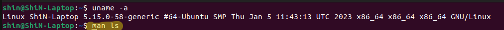
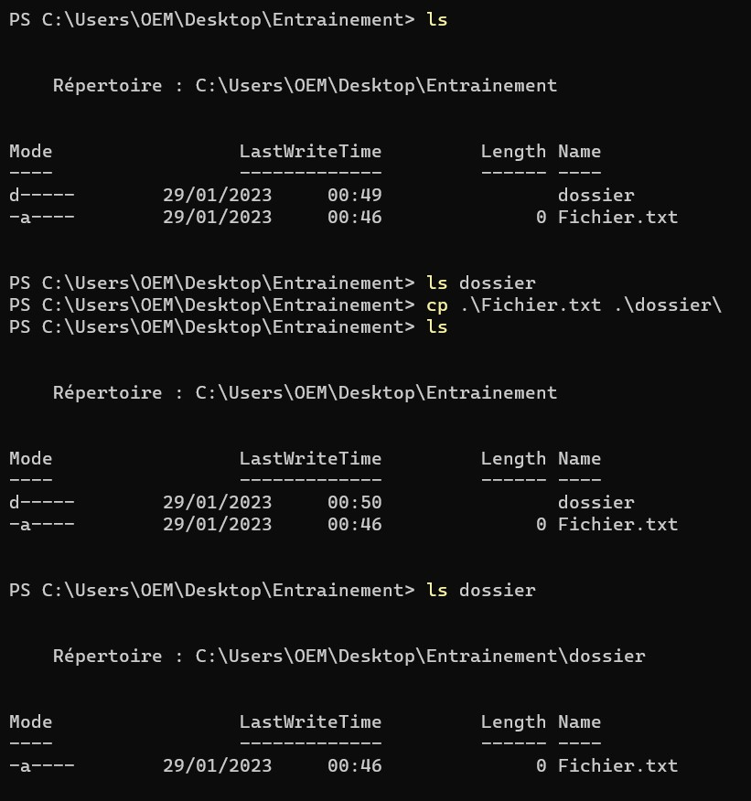

#  SAE 12 : GUIOT Thibault et Raid Neghouche
(Ce fichier est le livrable final de la SAE 12)

## <u>Introduction :</u>
<p><i>Ce guide a été effectué dans le simple et unique but, de vous former sur les commandes Linux et leur équivalence en Windows, afin que vous puissiez savoir comment résoudre un problème de réseau sur les machines utilisant ces systèmes d'exploitation</i></p>

##  Sommaire
- [SAE 12 : GUIOT Thibault et Raid Neghouche](#sae-12--guiot-thibault-et-raid-neghouche)
  - [Introduction :](#introduction-)
  - [Sommaire](#sommaire)
  - [Première partie : Vérification Physique](#première-partie--vérification-physique)
  - [Partie 1 : Listes des Commandes Linux/Windows Réseaux](#partie-1--listes-des-commandes-linuxwindows-réseaux)
  - [Partie 2 : Listes des commandes Linux/Windows OS](#partie-2--listes-des-commandes-linuxwindows-os)
  - [Partie 3 : Comment les utiliser sous Linux?](#partie-3--comment-les-utiliser-sous-linux)
    - [1) Commande réseaux :](#1-commande-réseaux-)
    - [2) Commande Système Basique :](#2-commande-système-basique-)
  - [Partie 4 : Comment les utiliser sous Windows?](#partie-4--comment-les-utiliser-sous-windows)
    - [1) Commande réseaux :](#1-commande-réseaux--1)
    - [2) Commande Système Basique :](#2-commande-système-basique--1)

</br>
</br>
</br>

## <u><b>Première partie : Vérification Physique</b></u>
<p>Dans un premier temps quelque chose qui reste à faire mais qui peut arriver avant de vous lancer dans l'utilisation de différentes commandes, veillez à vérifier le bon fonctionnement de votre câblage.</p>

<ul>
  <li>Vérifiez l'état de vos câbles, si ils sont encore fonctionnels ou non.
  <li>Vérifiez que votre Ordinateur soit bien relié à la prise murale
  <li>Et que la prise murale, soit bien reliée au Switch
</ul>

</br>
</br>
</br>


## <u><b>Partie 1 : Listes des Commandes Linux/Windows Réseaux</b></u>

</br>

| Linux | Windows | Signification |
| :--------------- |:---------------:| -----:|
| mii-tool | /// | Permet d'afficher et modifier certains paramètres de la carte réseau |
| dhclient | ipconfig /renew | Permet d'effectuer la configuration du client DHCP de plusieurs interfaces réseau |
| ping | ping | Utiliser pour déterminer la connectivité IP|
| ip | /// | Contient toutes les commandes de bases d'IP |
| ifconfig | ipconfig | Permet la vérification des Interfaces Réseaux |
| /// | route | Permet de vérifier la table de routage |
| traceroute | tracert | Permet la vérification des sauts |
| nslookup | nslookup | Effectue une requete DNS |
| arp | arp | Permet modifier et afficher la table ARP |
| /// | pathping | Vérifier la connectivité à un hôte |
| host | /// | Effectue des recherches DNS |
| ifconfig | getmac | Permet d'obtenir l'adresse Mac de votre interface |
| netstat | netstat | Identifie toutes les connexions TCP et UDP ouvertes sur un ordinateur |
| tcpdump | /// | Permet de capturer des trames en ligne de commande |
| /// | NetTCPIP | Commande spécifiques à Net TCP/IP |
| /// | Get-Host | Représente le programme hôte actuel |

</br>
</br>
</br>


## <u><b>Partie 2 : Listes des commandes Linux/Windows OS</b></u>
| Linux | Windows | Signification |
|:----------- |:--------------:|-------------:|
| man | man | Permet d'afficher la documentation de chaque commande |
| su | /// | Permet de passer en mode Administrateur |
| apt install | /// | Permet d'installer une commande |
| pip3 | /// | Permet d'installer une librairie (Python eg) |
| mkdir | mkdir | Permet la création d'un dossier |
| touch | type | Permet la création d'un fichier |
| cd | cd | Permet de se déplacer dans les différents répertoires |
| ls | ls | Permet d'afficher le contenu du répertoire |
| rmdir | rmdir | Permet de supprimer un dossier vide |
| cp | cp | Permet de copier coller un fichier/dossier|
| mv | mv | Permet de déplacer un fichier/dossier |
| rm | rm | Permet la suppression d'un fichier/dossier |
| nano | echo | Permet d'écrire dans un fichier '.txt' |
| cat | cat | Permet de lire un fichier |
| pwd | pwd | Permet d'afficher le répertoire |
| chmod | /// | Permet de modifier les droits d'un fichier |
| chown | takeown | Permet de transférer la propriété d'un fichier/dossier |

</br>
</br>
</br>

## <u>Partie 3 : Comment les utiliser sous Linux?</b></u>

### <li><u>1) Commande réseaux :</u></li>
<ul>

 <li><u><b>Commande Mii-Tool :</b></u>
 <ul>
  <p align="center">Sous Linux la commande <b>mii-tool</b> est une commande importante permettant d'afficher et modifier certains paramètres de la carte réseau, comme sa vitesse ou son duplex</p>
  <p>- <u>Sa syntaxe :</u></p>

  ```
  mii-tool [Interface]
  ```
  Il existe différents paramètres visible à l'aide de la commande :
  ```
  man mii-tool
  ```
  <p>- <u>Test de la commande :</u></p>
  

  >La commande mii-tool ci-dessus, permet d'afficher si le lien physique est correct. </br>
  > Nous pouvons voir grâce au résultat en rouge "link ok".
  </ul>
  </li>
</br>
</br>

 <li><u><b>Commande Dhclient :</u></b>
 <ul> 
  <p align="center">Sous Linux, la commande <b>Dhclient</b> permet d'effectuer la configuration du client DHCP de plusieurs interfaces réseau</p>

  <p>- <u>Sa syntaxe :</u></p>

  ```
  sudo dhclient
  ```
  Il existe différents paramètres visible à l'aide de la commande :
  ```
  man dhclient
  ```
  <p>- <u>Test de la commande :</u></p>
  
  
  >Comme nous pouvons le voir ci-dessus la commande ``dhclient`` a permis la configuration de l'adresse IP et l'adresse de Broadcast.
</li>
</ul>
</br>
</br>

 <li><u><b>Commande Ping :</b></u>
 <ul>
  <p align="center">Sous linux, la commande <b>ping</b> permet d'envoyer une demande d'écho sur un hôte réseau</p>

  <p>- <u>Sa syntaxe :</u></p>

  ```
  ping [Adresse Ciblée]
  ```
  Il existe différents paramètres visible à l'aide de la commande :
  ```
  man ping
  ```
  <p>- <u>Test de la commande :</u></p>
  
    
  > <p>Sur la commande ci-dessus, nous pouvons voir que l'adresse Ping, correspond à celle de google, nous pouvons voir également que 5 packets ont bien été transférer et reçu, cela signifie que notre machine peut communiquer avec internet.</p>
  <p align="center">Dans le cas ou notre machine ne serai pas conncté à internet, nous pouvons réaliser les différentes commandes ci-dessous</p>
</ul>  
  </li>
</br>
</br>

 <li><u><b>Commande IP :</b></u>
  <ul>
  <p align="center">La commande <b>IP</b>, possède énormément de paramètre, on peut ajouter des adresses IP, en supprimer, vérifier quelle adresse sont disponible sur les interface réseaux, etc..</p>
  
  <p>- <u>Sa syntaxe :</u></p>

  ```
  ip [paramètre(s)]
  ```
  L'ensemble de ces paramètres sont retrouvable dans le :
  ````
  man ip
  ````
  Pour vérifier la liste des interface réseau et les IP attribués:
  ````
  ip a
  ````
  

  > - Ci-dessus le résultat, en jaune la commande. </br>
  > - En rouge nous pouvous observer que sur l'interface réseau eno1, il y a l'adresse 10.207.13.1/16 qui lui est attribué.
  
  </br>

  Si votre interface réseau, ne possède pas d'adresse IP, voici comment en ajouter une :
  ```
  sudo ip a a [IP/Masque] dev [Interfaces]
  ```

  

  >- Dans un 1er temps, en bleu nous observons que l'interface n'a pas d'adresse IP.
  > - En jaune la commande
  > - En rouge, le résultat
  
  </br>
  <p>Après avoir configurer l'addresse IP souhaité, vérifier si la route est présente, à l'aide de la commande :</p>
  
  ```
  ip route ou ip r
  ```
  
  
  >- le résultat en rouge, nous montre que la route par défaut de notre interface est 10.207.255.254

  Dans le cas ou votre machine n'aurait pas de route par défaut, la commmande ci-dessous sera utile:
  ```
  sudo ip route add default via [Route] dev [Interfaces]
  ```
  
  
  >- En bleu nous pouvons voir qu'aucune route est disponible par défaut sur notre interface réseau (eno1)
  >- En jaune, la commande
  >- En rouge nous pouvons voir, que la route par défault à été ajouter.

  </br>
  <p>Si vous souhaitez supprimé, les adresses ip liées à votre interface réseau, la commande:</p>

  ```
  sudo ip addr flush dev eno1
  ```
  
  
  >Ci-dessus, après avoir validé la commande, nous pouvons voir que l'adresse ip sur l'interface eno1 à été supprimé.
</ul>
</li>
</br>
</br>

 <li><u><b>Commande Ifconfig :</b></u>
  <ul>
  <p align="center">La commande <b>ifconfig</b> est principalement utilisé pour afficher et modifier la configuration des interfaces réseau de votre système.</p>

  <p>- <u>Sa syntaxe :</u></p>

  ```
  ifconfig [paramètre]
  ```
  Il existe différents paramètres visible à l'aide de la commande :
  ```
  man ifconfig
  ```
  <p>- <u>Test de la commande :</u></p>
  

  >Cette commande permet tout comme la commande ``ip a`` de voir notre adresse IP, notre adresse MAC, et notre adresse Broadcast de notre interface réseau.

  <p>Il est également possible d'activer ou désactiver votre interface réseau à l'aide de la commande</p>

  ```
  ifup [Interface] ou ifdown [Interface]
  ```
</ul>
</li>
  </br>
  </br>

 <li><u><b>Commande Traceroute :</b></u>
<ul>
<p align="center">Imprime la route que les paquets IP empruntent pour accéder à un hôte réseau</p>

<p>- <u>Sa syntaxe :</u></p>

  ```
  traceroute [Adresse]
  ```
  Il existe différents paramètres visible à l'aide de la commande :
  ```
  man traceroute
  ```
  <p>- <u>Test de la commande :</u></p>
  
  
  >La commande ci-dessus, permet d'afficher la route prise par les paquets IP émis à destination de "google.com".
</ul>
</li>
  </br>
  </br>

 <li><u><b>Commande Nslookup :</b></u>
  <ul>
  <p align="center">La commande <b>nslookup</b> est principalement utilisé pour trouver l'adresse IP d'un hôte spécifique ou le nom de domaine d'une adresse IP spécifique (recherche DNS inverse)</p>

<p>- <u>Sa syntaxe :</u></p>

  ```
  nslookup
  ```
  Il existe différents paramètres visible à l'aide de la commande :
  ```
  man nslookup
  ```
  <p>- <u>Test de la commande :</u></p>
  

  >Ci-dessus, nous pouvons voir que nous avons interroger le domaine wikipédia.org, cela nous affiche son serveur et son adresse.
</ul>
</li>
</br>
</br>


 <li><u><b>Commande ARP :</b></u>
<ul>
<p align="center">La commande <b>ARP</b> permet la consultation et parfois la modification de la table ARP dans certains systèmes d'exploitation</p>
<p>- <u>Sa syntaxe :</u></p>

  ```
  arp
  ```
  Il existe différents paramètres visible à l'aide de la commande :
  ```
  man arp
  ```
  <p>- <u>Test de la commande :</u></p>
  

  >La commande résulte l'adresse MAC de l'interface eno1.
</ul>
</li>
</br>
</br>

 <li><u><b>Commande Host :</b></u>
<ul>
<p align="center">La commande <b>Host</b> permet d'effectuer des recherches DNS</p>
<p>- <u>Sa syntaxe :</u></p>

  ```
  host [Domaine]
  ```
  Il existe différents paramètres visible à l'aide de la commande :
  ```
  man host
  ```
  <p>- <u>Test de la commande :</u></p>
  

  >La commande permet ci-dessus d'obtenir l'adresse de Google, et Wikipédia..
</ul>
</li>
</br>
</br>


 <li><u><b>Commande Netstat :</b></u>
<ul>
<p align="center">La commande présenté ci-dessous permet d'identifier toutes les connexions TCP et UDP ouvertes sur un ordinateur</p>
<p>- <u>Sa syntaxe :</u></p>

  ```
  netstat
  ```
  Il existe différents paramètres visible à l'aide de la commande :
  ```
  man netstat
  ```
  <p>- <u>Test de la commande :</u></p>
  

  >Ci-dessus, nous pouvons voir les différentes connexions TCP de notre machine.
</ul>
</li>
</br>
</br>

 <li><u><b>Commande TCPdump :</b></u>
  <ul>
  <p align="center">Cette dernière commande permet d'effectuer des trames ethernet en ligne de commande tout comme le fait Wireshark</p>
  <p>- <u>Sa syntaxe :</u></p>

  ```
  sudo tcpdump [paramètres]
  ```
  Il existe différents paramètres visible à l'aide de la commande :
  ```
  man tcpdump
  ```
  <p>- <u>Test de la commande :</u></p>
  

  >Ci-dessus, nous pouvons voir les trames capturer par la commande.
  
</ul>
</li>
</ul>
</br>

### <li><u>2) Commande Système Basique :</u></li>
  <ul>

   <li><u><b>Commande Man :</b></u>
  <ul>
  <p align="center">Sous Linux la commande <b>MAN</b> permet de visionner les contenus d'une documentation formatée pour être exploitable par man</p>
  <p>- <u>Sa syntaxe :</u></p>

  ```
  man [Nom de la commande]
  ```
  Il existe différents paramètres visible à l'aide de la commande :
  ```
  man man
  ```
  <p>- <u>Test de la commande :</u></p>
  
  

  >Ci-dessus nous pouvons voir que la commande résulte tout les paramètres de LS
  </ul>
  </li>
  </br>
  </br>

   <li><u><b>Commande SU :</b></u>
  <ul>
  <p align="center">Cette commande permet à un utilisateur de passer en mode root (administrateur) sur sa machine</p>
  <p>- <u>Sa syntaxe :</u></p>

  ```
  su
  ```
  Il existe différents paramètres visible à l'aide de la commande :
  ```
  man su
  ```
  <p>- <u>Test de la commande :</u></p>
  
  
  >Nous pouvons voir qu'après avoir rentrer la commande su, la machine nous demande le mot de passe administrateur et qu'après nous sommes en mode root.
  </ul>
  </li>
  </br>
  </br>

   <li><u><b>Commande apt install :</b></u>
  <ul>
  <p align="center">Cette commande permet d'installer un logiciel et paquet sur votre machine</p>
  <p>- <u>Sa syntaxe :</u></p>

  ```
  sudo apt install [Nom du paquet/fichier]
  ```
  Il existe différents paramètres visible à l'aide de la commande :
  ```
  man apt
  ```
  <p>- <u>Test de la commande :</u></p>
  
  
  >Après avoir rentrer cette commande nous pouvons voir que le paquet voulu se télécharge. 
  </ul>
  </li>
  </br>
  </br>

   <li><u><b>Commande pip3 install :</b></u>
  <ul>
  <p align="center">Cette commande permet principalement d'installer des librairies pour python par exemple/</p>
  <p>- <u>Sa syntaxe :</u></p>

  ```
  sudo pip3 install [Nom de la Librairie]
  ```
  Il existe différents paramètres visible à l'aide de la commande :
  ```
  man pip3
  ```
  <p>- <u>Test de la commande :</u></p>
  
  
  >Nous pouvons voir que la commande à bien installer la librairie dans notre cas : lxml.
  </ul>
  </li>
  </br>
  </br>

   <li><u><b>Commande Mkdir :</b></u>
  <ul>
  <p align="center">Cette commande permet la création d'un dossier</p>
  <p>- <u>Sa syntaxe :</u></p>

  ```
  mkdir [Nom du dossier ou des dossiers]
  ```
  Il existe différents paramètres visible à l'aide de la commande :
  ```
  man mkdir
  ```
  <p>- <u>Test de la commande :</u></p>
  
  
  >Nous pouvons voir après la saisi de la commande l'apparition du dossier "Dossier" 
  </ul>
  </li>
  </br>
  </br>

   <li><u><b>Commande Touch :</b></u>
  <ul>
  <p align="center">Cette commander permet de créer un fichier.</p>
  <p>- <u>Sa syntaxe :</u></p>

  ```
  touch [Nom du fichier]
  ```
  Il existe différents paramètres visible à l'aide de la commande :
  ```
  man touch
  ```
  <p>- <u>Test de la commande :</u></p>
  

  > La création du fichier nommé "fichier" à été effectuer.
  </ul>
  </li>
  </br>
  </br>

   <li><u><b>Commande CD :</b></u>
  <ul>
  <p align="center">Cette commande permet de se déplacer dans les répertoires de notre machine</p>
  <p>- <u>Sa syntaxe :</u></p>

  ```
  cd [Destination]
  ```
  Il existe différents paramètres visible à l'aide de la commande :
  ```
  man cd
  ```
  <p>- <u>Test de la commande :</u></p>
  
  </ul>
  </li>
  </br>
  </br>

   <li><u><b>Commande LS :</b></u>
  <ul>
  <p align="center">Cette commande permet de lister le contenu d'un dossier</p>
  <p>- <u>Sa syntaxe :</u></p>

  ```
  ls [Paramètre(s)]
  ```
  Il existe différents paramètres visible à l'aide de la commande :
  ```
  man ls
  ```
  <p>- <u>Test de la commande :</u></p>
  
  </ul>
  </li>
  </br>
  </br>

   <li><u><b>Commande rmdir :</b></u>
  <ul>
  <p align="center">La commande permet la suppression de dossier</p>
  <p>- <u>Sa syntaxe :</u></p>

  ```
  rmdir [Nom du dossier]
  ```
  Il existe différents paramètres visible à l'aide de la commande :
  ```
  man rmdir
  ```
  <p>- <u>Test de la commande :</u></p>
  
  
  </ul>
  </li>
  </br>
  </br>

   <li><u><b>Commande CP :</b></u>
  <ul>
  <p align="center">Elle permet de copier coller un fichier ou un dossier d'un point A à un point B.</p>
  <p>- <u>Sa syntaxe :</u></p>

  ```
  cp [nom du fichier] [Direction]
  ```
  Il existe différents paramètres visible à l'aide de la commande :
  ```
  man cp
  ```
  <p>- <u>Test de la commande :</u></p>
  

  >Nous avons copié le fichier depuis "/Bureau" et l'avons copié dans le dossier "/TEST"
  </ul>
  </li>
  </br>
  </br>

   <li><u><b>Commande MV :</b></u>
  <ul>
  <p align="center">Elle permet de déplacer un fichier ou un dossier d'un point A à un point B.</p>
  <p>- <u>Sa syntaxe :</u></p>

  ```
  mv [Nom du fichier] [Départ] [Arrivé]
  ```
  Il existe différents paramètres visible à l'aide de la commande :
  ```
  man mv
  ```
  <p>- <u>Test de la commande :</u></p>
  

  >Nous avons déplacer le fichier de "/Bureau" à "/TEST"
  </ul>
  </li>
  </br>
  </br>

   <li><u><b>Commande RM :</b></u>
  <ul>
  <p align="center">Elle permet la suppression d'un fichier</p>
  <p>- <u>Sa syntaxe :</u></p>

  ```
  rm [Nom du fichier]
  ```
  Il existe différents paramètres visible à l'aide de la commande :
  ```
  man rm
  ```
  <p>- <u>Test de la commande :</u></p>
  
  </ul>
  </li>
  </br>
  </br>

   <li><u><b>Commande Nano :</b></u>
  <ul>
  <p align="center">Cette commande permet d'écrire dans un fichier texte tout en ligne de commande</p>
  <p>- <u>Sa syntaxe :</u></p>

  ```
  nano [Nom du fichier]
  ```
  Il existe différents paramètres visible à l'aide de la commande :
  ```
  man nano
  ```
  <p>- <u>Test de la commande :</u></p>
  
  

  >Dans notre fichier, nous avons écrit "Bonjour le monde"
  </ul>
  </li>
  </br>
  </br>

   <li><u><b>Commande Cat :</b></u>
  <ul>
  <p align="center">Très utiliser pour affichier le contenu d'un fichier en sortie standard</p>
  <p>- <u>Sa syntaxe :</u></p>

  ```
  cat [Nom du fichier]
  ```
  Il existe différents paramètres visible à l'aide de la commande :
  ```
  man cat
  ```
  <p>- <u>Test de la commande :</u></p>
  

  >Cette commande permet de lire ce qu'il y a d'écrit dans un fichier, ici "Bonjour le monde"
  </ul>
  </li>
  </br>
  </br>

   <li><u><b>Commande Pwd :</b></u>
  <ul>
  <p align="center">Cette commande permet d'afficher le Répertoire dans lequel on se trouve.</p>
  <p>- <u>Sa syntaxe :</u></p>

  ```
  pwd
  ```
  Il existe différents paramètres visible à l'aide de la commande :
  ```
  man pwd
  ```
  <p>- <u>Test de la commande :</u></p>
  
  </ul>
  </li>
  </br>
  </br>

   <li><u><b>Commande Chmod :</b></u>
  <ul>
  <p align="center">Cette commande permet de changer les droits d'un fichier ou d'un dossier</p>
  <p>- <u>Sa syntaxe :</u></p>
  </br>
  <p>Le code de droit: (7 bits par utilisateurs, min: 111 et max = 777</p>
  <ul>
    <li>1 = Exécution</li>
    <li>2 = Lecture</li>
    <li>4 = Ecriture</li>
  </ul>
  </br>

  ```
  chmod [Code de droit] [Nom du Fichier/Dossier]
  ```
  Il existe différents paramètres visible à l'aide de la commande :
  ```
  man chmod
  ```
  <p>- <u>Test de la commande :</u></p>
  
  
  >La commande à permis de passer de "drwxrwxr-w" à "dr--r--r--"
  </ul>
  </li>
  </br>
  </br>

   <li><u><b>Commande Chown :</b></u>
  <ul>
  <p align="center">Permet de transférer la propriété d'un dossier/fichier</p>
  <p>- <u>Sa syntaxe :</u></p>

  ```
  chown [Options] [Propriétaire] [Fichier(s)/Dossier(s)]
  ```
  Il existe différents paramètres visible à l'aide de la commande :
  ```
  man chown
  ```
  <p>- <u>Test de la commande :</u></p>
  
  </ul>
  </li>
  </ul>
</ul>

</br>
</br>
</br>


## <u>Partie 4 : Comment les utiliser sous Windows?</b></u>

<p><i>La partie Windows en Réseaux ne sera pas réellement complète, car je n'ai pas souhaiter effectuer les commandes de configuration sur mon Ordinateur personnel, afin d'éviter tout problème de configuration^^ Mais les recherches sont présentes. Les données noircis sur les captures d'écran sont mes adresses IP, etc que je ne souhaite pas faire apparaitre</i></p>
<ul>
  
### <li><u>1) Commande réseaux :</u></li>
  <ul>  

   <li><u><b>Commande IpConfig :</b></u>
  <ul>
  <p align="center">Cette commande permet de vérifier les différents interface réseau est de les configurer</p>
  
  <p>- <u>Sa syntaxe :</u></p>

  ```
  ipconfig [Paramètres]
  ```
  Il existe différents paramètres visible à l'aide de la commande, pour la configuration réseaux disponible grâce à :
  ```
  man ipconfig
  ```
  <p>- <u>Test de la commande :</u></p>
  

  >Sur la capture ci-dessus nous pouvons voir différentes informations sur nos interfaces, etc...
  </ul>
  </li>
  </br>
  </br>

   <li><u><b>Commande Ping :</b></u>
  <ul>
  <p align="center">Tout comme Linux, sous Windows la commande <b>ping</b> permet d'envoyer une demande d'écho sur un hôte réseau</p>

  <p>- <u>Sa syntaxe :</u></p>

  ```
  ping [Hôte]
  ```
  Il existe différents paramètres visible à l'aide de la commande :
  ```
  man ping
  ```
  <p>- <u>Test de la commande :</u></p>
  
  </ul>
  </li>
  </br>
  </br>

   <li><u><b>Commande Route :</b></u>
<ul>
<p align="center">La commande <b>Route</b> permet de vérifier la table de routage</p>
<p>- <u>Sa syntaxe :</u></p>

  ```
  route print
  ```
  Il existe différents paramètres visible à l'aide de la commande :
  ```
  man route
  ```
  <p>- <u>Test de la commande :</u></p>
  

  >Sur la capture ci-dessus nous pouvons voir différentes informations sur nos table de routage en IPv4 et IPv6
  </li>
  </br>
  </br>

   <li><u><b>Commande tracert :</b></u>
  <p align="center">Imprime la route que les paquets IP empruntent pour accéder à un hôte réseau</p>
  <p>- <u>Sa syntaxe :</u></p>

  ```
  tracert [Hôte]
  ```
  Il existe différents paramètres visible à l'aide de la commande :
  ```
  man tracert
  ```
  <p>- <u>Test de la commande :</u></p>
  
</ul>
  </li>
  </br>
  </br>

   <li><u><b>Commande nslookup :</b></u>
  <ul>
  <p align="center">Permet d'effectuer une requete DNS</p>
  <p>- <u>Sa syntaxe :</u></p>

  ```
  nslookup
  ```
  Il existe différents paramètres visible à l'aide de la commande :
  ```
  man nslookup
  ```
  <p>- <u>Test de la commande :</u></p>
  
  </ul>
  </li>
  </br>
  </br>

   <li><u><b>Commande arp :</b></u>
  <ul>
  <p align="center">Cette commande permet d'afficher la table ARP</p>
  <p>- <u>Sa syntaxe :</u></p>

  ```
  arp -a
  ```
  Il existe différents paramètres visible à l'aide de la commande :
  ```
  man arp
  ```
  <p>- <u>Test de la commande :</u></p>
  
  </ul>
  </li>
  </br>
  </br>

   <li><u><b>Commande pathping :</b></u>
  <ul>
  <p align="center">Cette commande permet de vérifier la connectivité à un hôte</p>
  <p>- <u>Sa syntaxe :</u></p>

  ```
  pathping [Hôte]
  ```
  Il existe différents paramètres visible à l'aide de la commande :
  ```
  man pathping
  ```
  <p>- <u>Test de la commande :</u></p>
  
  </ul>
  </li>
  </br>
  </br>

   <li><u><b>Commande Get-Mac :</b></u>
  <ul>
  <p align="center">Cette commande permet d'obtenir les adresses mac de nos interface</p>
  <p>- <u>Sa syntaxe :</u></p>

  ```
  getmac
  ```
  Il existe différents paramètres visible à l'aide de la commande :
  ```
  man getmac
  ```
  <p>- <u>Test de la commande :</u></p>
  
  </ul>
  </li>
  </br>
  </br>

   <li><u><b>Commande Netstat</b></u>
  <ul>
  <p align="center">Identifie toutes les connexions TCP et UDP ouvertes sur votre ordinateurs.</p>
  <p>- <u>Sa syntaxe :</u></p>

  ```
  netstat
  ```
  Il existe différents paramètres visible à l'aide de la commande :
  ```
  man netstat
  ```
  <p>- <u>Test de la commande :</u></p>
  
  </ul>
  </li>
  </br>
  </br>

   <li><u><b>Répertoire NetTCIP :</b></u>
  <ul>
  <p align="center">Ce répertoire possède différentes commandes très utiles que vous pourrez retrouvez ci-dessous :</p>
  <p>https://learn.microsoft.com/en-us/powershell/module/nettcpip/?view=windowsserver2019-ps</p>
  <p align="center">Voici quelques exemples de commande disponible</p>
  
  <p>- <u>Get-NetIPAddress</u></p>
  <p>Permet d'obtenir la configuration IP</p>

  ```
  Get-NetIPAddress
  ```
  <p>- <u>Test Get-NetIPAddress :</u></p>
  

  <p>- <u>Get-NetNeighbor</u></p>
  <p>Permet d'obtenir les entrées du cache voisin</p>

  ```
  Get-NetNeighbor
  ```
  <p>- <u>Test Get-NetNeighbor :</u></p>
  

  <p>- <u>Configuration IP</u></p>
  
  ```
  New-NetIPAddress
  Remove-NetIPAddress
  ```

<p>C'est 2 commandes permettent d'ajouter de supprimer une adresse IP</p>
<p>Leur utilisation :</p>

```
New-NetIPAddress [InterfaceIndex] [IP] [/Masque] [Passerelle]
Remove-NetIPAddress [IP] [Passerelle]
```
<p>Plusieurs commandes sont visibles sur le lien mis au dessus.</p>
  </ul>
  </li>
  </br>
  </br>

 <li><u><b>Commande Get-Host :</b></u>
  <ul>
  <p align="center">Cette commande permet de représenter le programme d'hôte actuel.</p>
  <p>- <u>Sa syntaxe :</u></p>

  ```
  get-host
  ```
  Il existe différents paramètres visible à l'aide de la commande :
  ```
  man get-host
  ```
  <p>- <u>Test de la commande :</u></p>
  
  </ul>
  </li>
  </br>
  </br>
</ul>
  
### <li><u>2) Commande Système Basique :</u></li>

  <ul>

   <li><u><b>Commande Man :</b></u>
  <ul>
  <p align="center">Sous Windows la commande <b>MAN</b> permet de visionner les contenus d'une documentation formatée pour être exploitable par man</p>
  <p>- <u>Sa syntaxe :</u></p>

  ```
  man [Nom de la commande]
  ```
  Il existe différents paramètres visible à l'aide de la commande :
  ```
  man man
  ```
  <p>- <u>Test de la commande :</u></p>
  

  </ul>
  </li>

  </br>
  </br>


   <li><u><b>Commande Mkdir :</b></u>
  <ul>
  <p align="center">Cette commande permet la création d'un dossier</p>
  <p>- <u>Sa syntaxe :</u></p>

  ```
  mkdir [Nom du dossier ou des dossiers]
  ```
  Il existe différents paramètres visible à l'aide de la commande :
  ```
  man mkdir
  ```
  <p>- <u>Test de la commande :</u></p>
  
  
  >Nous pouvons voir après la saisi de la commande l'apparition du dossier "Dossier" 
  </ul>
  </li>
  </br>
  </br>

   <li><u><b>Commande Type :</b></u>
  <ul>
  <p align="center">Cette commande permet de créer un fichier</p>
  <p>- <u>Sa syntaxe :</u></p>

  ```
  type nul > [Nom du Fichier]
  ```
  Il existe différents paramètres visible à l'aide de la commande :
  ```
  man type
  ```
  <p>- <u>Test de la commande :</u></p>
  

  > Le message d'erreur veut dire que comme le fichier n'exister pas la valeur nulle est vrai donc la création du fichier nommé "fichier.txt" à été effectuer.
  </ul>
  </li>
  </br>
  </br>

   <li><u><b>Commande CD :</b></u>
  <ul>
  <p align="center">Cette commande permet de se déplacer dans les répertoires de notre machine</p>
  <p>- <u>Sa syntaxe :</u></p>

  ```
  cd [Destination]
  ```
  Il existe différents paramètres visible à l'aide de la commande :
  ```
  man cd
  ```
  <p>- <u>Test de la commande :</u></p>
  
  </ul>
  </li>
  </br>
  </br>

   <li><u><b>Commande LS :</b></u>
  <ul>
  <p align="center">Cette commande permet de lister le contenu d'un dossier</p>
  <p>- <u>Sa syntaxe :</u></p>

  ```
  ls [Paramètre(s)]
  ```
  Il existe différents paramètres visible à l'aide de la commande :
  ```
  man ls
  ```
  <p>- <u>Test de la commande :</u></p>
  
  </ul>
  </li>
  </br>
  </br>

   <li><u><b>Commande rmdir :</b></u>
  <ul>
  <p align="center">La commande permet la suppression de dossier</p>
  <p>- <u>Sa syntaxe :</u></p>

  ```
  rmdir [Nom du dossier]
  ```
  Il existe différents paramètres visible à l'aide de la commande :
  ```
  man rmdir
  ```
  <p>- <u>Test de la commande :</u></p>
  
  </ul>
  </li>
  </br>
  </br>

   <li><u><b>Commande CP :</b></u>
  <ul>
  <p align="center">Elle permet de copier coller un fichier ou un dossier d'un point A à un point B.</p>
  <p>- <u>Sa syntaxe :</u></p>

  ```
  cp [nom du fichier] [Direction]
  ```
  Il existe différents paramètres visible à l'aide de la commande :
  ```
  man cp
  ```
  <p>- <u>Test de la commande :</u></p>
  
  </ul>
  </li>
  </br>
  </br>

   <li><u><b>Commande MV :</b></u>
  <ul>
  <p align="center">Elle permet de déplacer un fichier ou un dossier d'un point A à un point B.</p>
  <p>- <u>Sa syntaxe :</u></p>

  ```
  mv [Nom du fichier] [Départ] [Arrivé]
  ```
  Il existe différents paramètres visible à l'aide de la commande :
  ```
  man mv
  ```
  <p>- <u>Test de la commande :</u></p>
  
  </ul>
  </li>
  </br>
  </br>

   <li><u><b>Commande RM :</b></u>
  <ul>
  <p align="center">Elle permet la suppression d'un fichier</p>
  <p>- <u>Sa syntaxe :</u></p>

  ```
  rm [Nom du fichier]
  ```
  Il existe différents paramètres visible à l'aide de la commande :
  ```
  man rm
  ```
  <p>- <u>Test de la commande :</u></p>
  
  </ul>
  </li>
  </br>
  </br>

   <li><u><b>Commande echo :</b></u>
  <ul>
  <p align="center">Cette commande permet d'écrire dans un fichier texte tout en ligne de commande</p>
  <p>- <u>Sa syntaxe :</u></p>

  ```
  echo "message" > [Nom du fichier]
  ```
  Il existe différents paramètres visible à l'aide de la commande :
  ```
  man echo
  ```
  <p>- <u>Test de la commande :</u></p>
  

  >Dans notre fichier, nous avons écrit "coucou"
  </ul>
  </li>
  </br>
  </br>

   <li><u><b>Commande Cat :</b></u>
  <ul>
  <p align="center">Très uliser pour affichier le contenu d'un fichier en sortie standard</p>
  <p>- <u>Sa syntaxe :</u></p>

  ```
  cat [Nom du fichier]
  ```
  Il existe différents paramètres visible à l'aide de la commande :
  ```
  man cat
  ```
  <p>- <u>Test de la commande :</u></p>
  

  >Cette commande permet de lire ce qu'il y a d'écrit dans un fichier, ici "coucou"
  </ul>
  </li>
  </br>
  </br>

   <li><u><b>Commande Pwd :</b></u>
  <ul>
  <p align="center">Cette commande permet d'afficher le Répertoire dans lequel on se trouve.</p>
  <p>- <u>Sa syntaxe :</u></p>

  ```
  pwd
  ```
  Il existe différents paramètres visible à l'aide de la commande :
  ```
  man pwd
  ```
  <p>- <u>Test de la commande :</u></p>
  
  </ul>
  </li>
  </br>
  </br>

<li><u><b>Commande Takeown :</b></u>
  <ul>
  <p align="center">Permet de transférer la propriété d'un dossier/fichier</p>
  <p>- <u>Sa syntaxe :</u></p>

  ```
  takeown /f [Nom du Fichier]
  ```
  Il existe différents paramètres visible à l'aide de la commande :
  ```
  man takeown
  ```
  <p>- <u>Test de la commande :</u></p>
  
  </ul>
  </li>
  </ul>
</ul>

</br>
</br>
</br>
</ul>

<p align="center"><b>J'espère que ce tutoriel vous aura aider à comprendre certaines commande sous Windows et Linux</b></p>