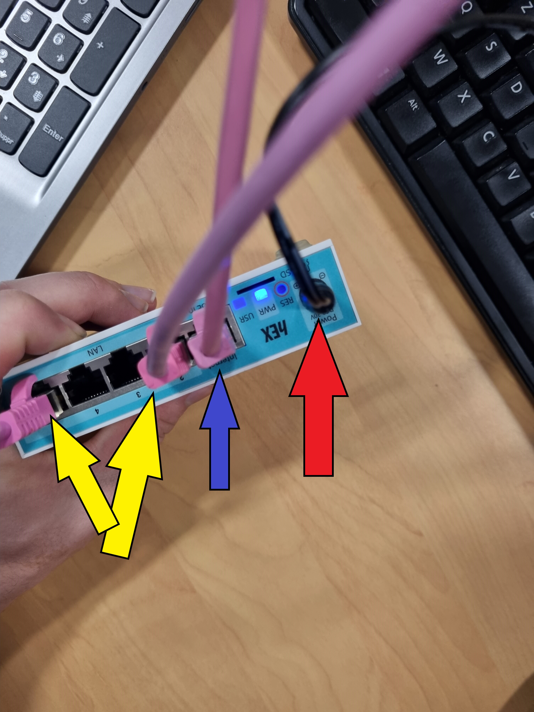
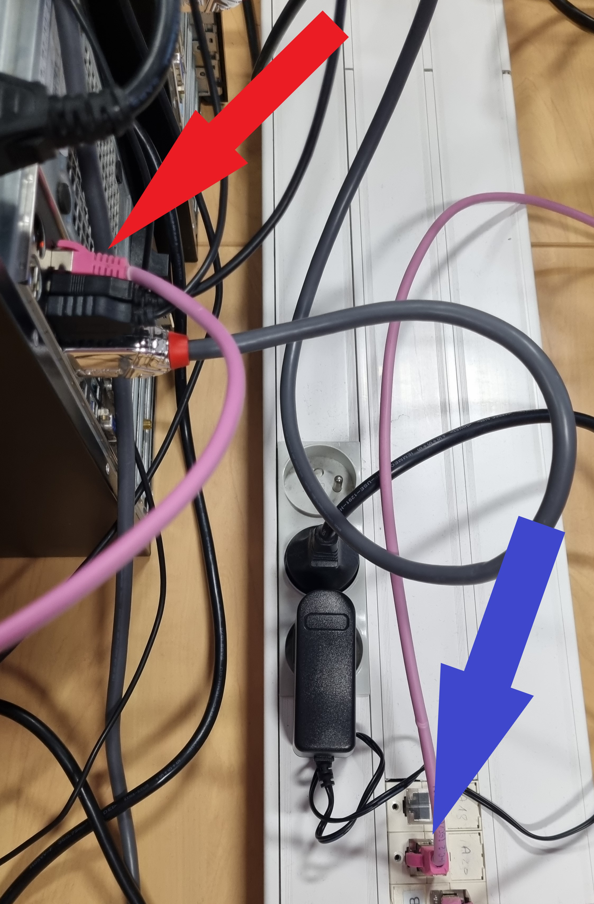
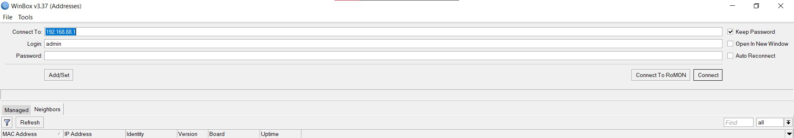
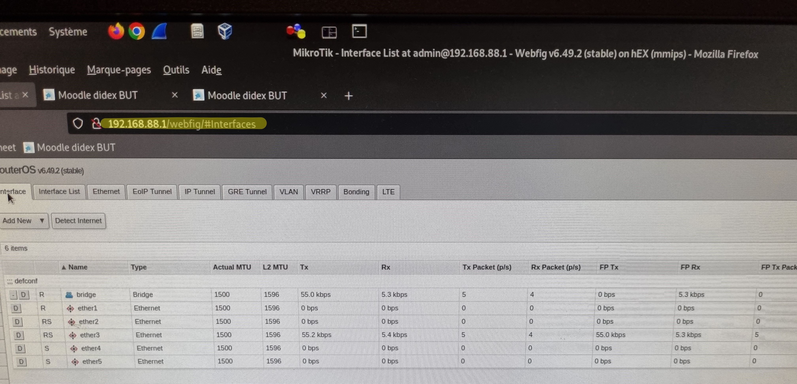
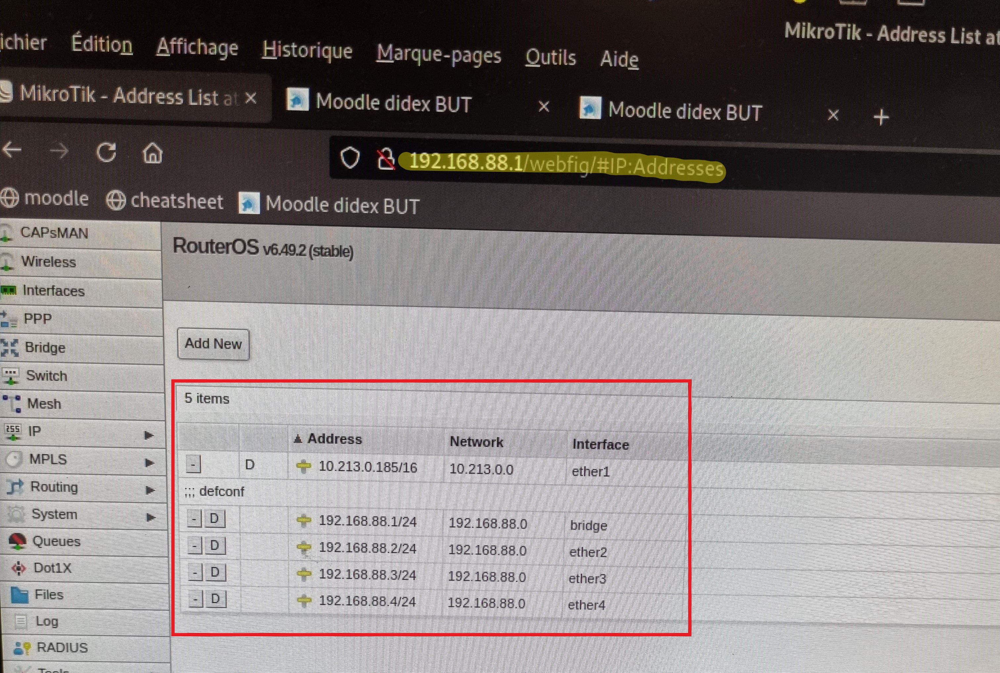
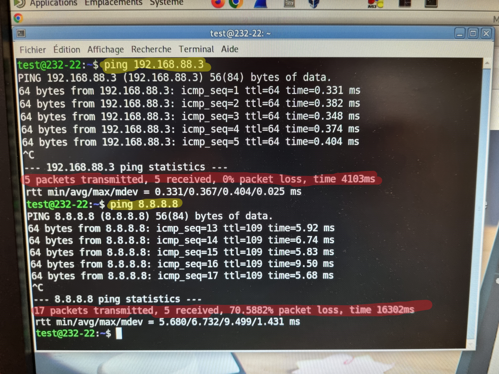

# 
<b><u>Compte Rendu Mikrotik</u></b>

Le Mikrotik est une partie de notre travail dans cette SAE, l'objectif était de le configurer afin qu'il fonctionne en tant que routeur.

 
 

### 
<u>Découverte du Mikrotik :</u>

Dans un premier temps avant de commmencer la configuration du Mikotik, il à fallu le découvrir.

<u><b>A quoi sert-il?</b></u>

Le <b>MikroTik RouterOS</b> est un système d'exploitation de routage open source basé sur Linux qui a été conçu à l'origine pour être utilisé sur de petits réseaux informatiques.

Sur les images ci-dessus, nous montre que le Mikrotik est un mini routeur, possédant :

<ul>
    <li>Un port pour l'alimentation.</li>
    <li>Un port pour être relié au réseau internet.</li>
    <li>4 ports RJ45, pouvant acceuillir jusqu'à 4 machines.</li>
</ul>
 
 
 

### 
<u>1ère mise en route :
</u>

 

Dans un premier temps, il fallait réinitialiser le routeur Mikrotik, pour cela différentes étapes, ci-dessous :

>Dans un premier temps veillez à vous référer à l'image ci-dessus.

 
<ul>
    <li>Appuyez pendant 5secondes sur le bouton reset (flèches rouges).</li>
    <li>Tout en restant appuyer, mettez sous tension le mikrotik (flèche bleue).</li>
    <li>3secondes après la mise en tension, relachez le bouton reset.</li>
    <li>Après cela, veuillez attendre à peu près 1 minutes afin que le Mikrotik se réinitialise, pour cela vous entendrez un 1er bip, puis 2 autres bips bient distinct.</li>
</ul>

 
 
 

### 
<u>Branchement Physique :
</u>

Afin de réaliser sa première configuration, il à fallu effectuer le 1er branchement

>- La flèche rouge montre la mise en tension  
>- La flèche bleue montre le lien entre le Routeur et Internet 
>- Les flèches jaunes montrent nos 2 machines reliés au routeur.

 
 

>- La flèche rouge nous montre la machine 1 qui est relié
>- La flèche bleue nous montre la liaison entre le routeur et internet

 
 
 

### 
<u><b>Sa configuration Virutelle :</b></u>

Après avoir réinitialiser le Mikrotik, l'avoir branché, il à fallu le configurer, pour ce faire j'ai du utiliser plusieurs choses.

<ul>
    <li>Le logiciel WinBox</li>
    <li>L'application en ligne fournis par le Mikrotik</li>
</ul>

 
 

Pour commencer la configuration virtuelle du Mikrotik en tant que routeur, il à fallu trouver l'adresse ip du Mikrotik, dans mon cas pour cela j'ai utiliser le logiciel <b>WinBox</b>.

>Sur la capture ci-dessus, l'information 'connect to' contient une adresse IP, elle correspond à celle du Mikrotik.

 
 

Après avoir obtenu cette information je me suis rendu  sur internet avec 1 de mes 2 machines afin d'acceder au terminal de cette adresse IP

 
 

Pour commencer j'ai du configurer les différents interfaces du Routeur Mikrotik en leur attribuant des adresses respectives à chaque interface.

>Ci-dessus nous pouvons voir par exemple que l'interface 'ether 2' à l'adresse IP '192.168.88.22/24' qui lui est attribuée.

 
 

Après avoir réalisé cela il à fallu faire des configurations IP sur les machines malheuresement je n'ai pas pensé à prendre des captures d'écran de cette étape la..

Mais cela à requis de l'utilisation des commandes :

``ip a a [IP/Masque] dev [Interfaces]``

Après avoir fait la configuration des adresses IP, etc... Il à fallu vérifier le bon fonctionnement du Mikrotik, à l'aide de Ping.

>Ci-dessus nous avons deux informations :
>- Le ping 192.168.88.3, qui permet de voir la connexion entre nous 2 machines et elles communiquent bien
>- Le ping 8.8.8.8, le réseau sur lequel nous travaillons n'étant pas optimisé, le passage sur Mikrotik réduit le débit, ce qui empeche certains paquets de passées.

 
 
 

Pour conclure l'installation du Mikrotik à été assez rapide, il est facile à configurer et au final nous avons la connexion qui se réalise bien entre nos machines et internet.

