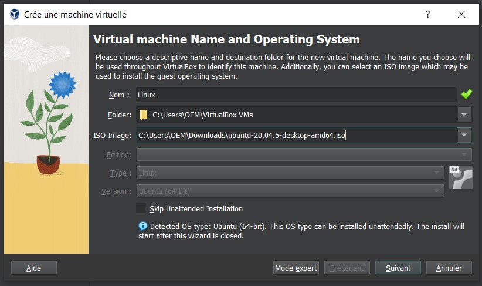
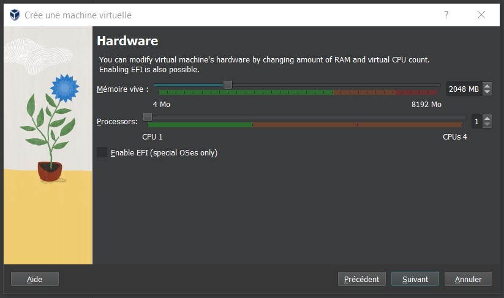
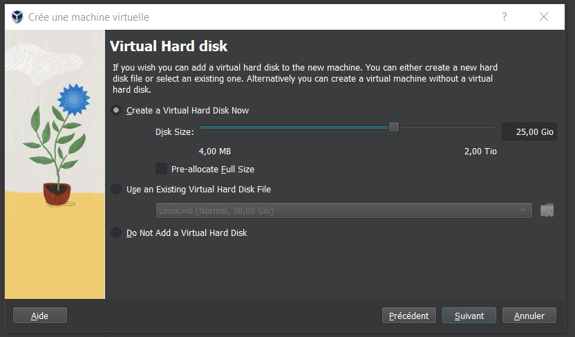
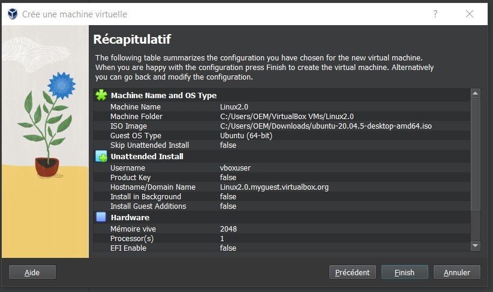
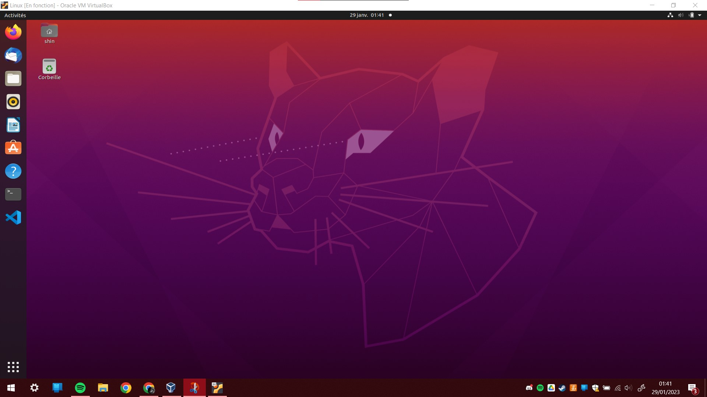

# 
<u>Installation d'une VM</u>

La dernière étape de notre SAE est d'installer une VM.

### 
<u><b>Dérouler de l'installation :</b></u>

>Ici nous retrouvons la base de l'installation, nous devons mettre au préalable le fichier ISO de l'OS souhaiter télécharger sur internet

 

>Ci-dessus nous devons indiquer combien de RAM et de CPU nous accordons à notre VM.

 

>Ici, nous indiquons la taille du disque que nous alloué

 

>Ici un récapitulatif de comment nous avons configurer notre VM

 

>Pour finir, il ne vous reste plus qu'à lancer votre VM et suivre les indications que l'OS vous donne pour l'installation (Création compte utilisateur, etc...)

 
 
 

### 
<u><b>Preuve des VMS :</b></u>

